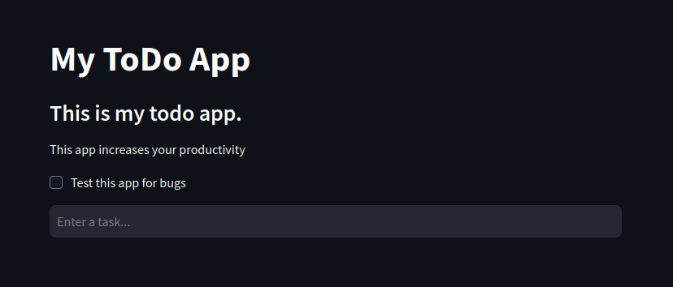

# Simple ToDo App

A really simple ToDo app written in Python! Deployed to Streamlit's Cloud.

[](https://simple-todo-app-biem.streamlit.app)

## Run Locally

Clone the project

```bash
  git clone https://github.com/TheBiemGamer/simple-todo-app
```

Go to the project directory

```bash
  cd simple-todo-app
```

Install dependencies

```bash
  pip install -r requirements.txt
```

Start the server

```bash
  streamlit run web.py
```


## Authors

- [@thebiemgamer](https://www.github.com/TheBiemGamer)